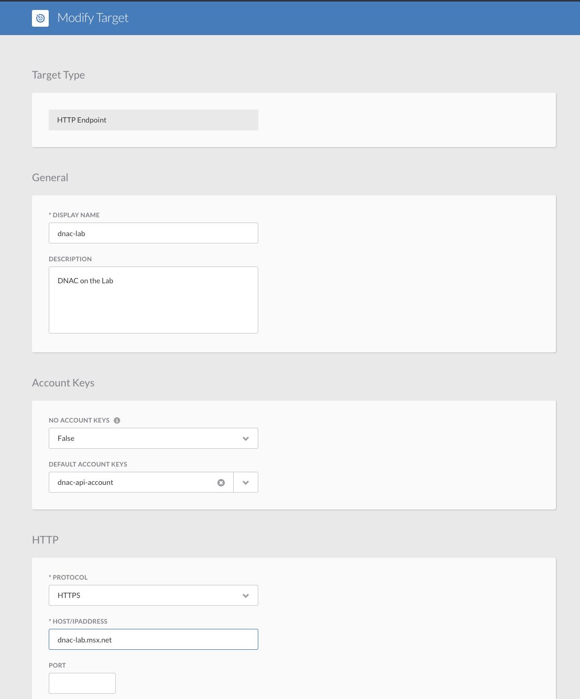
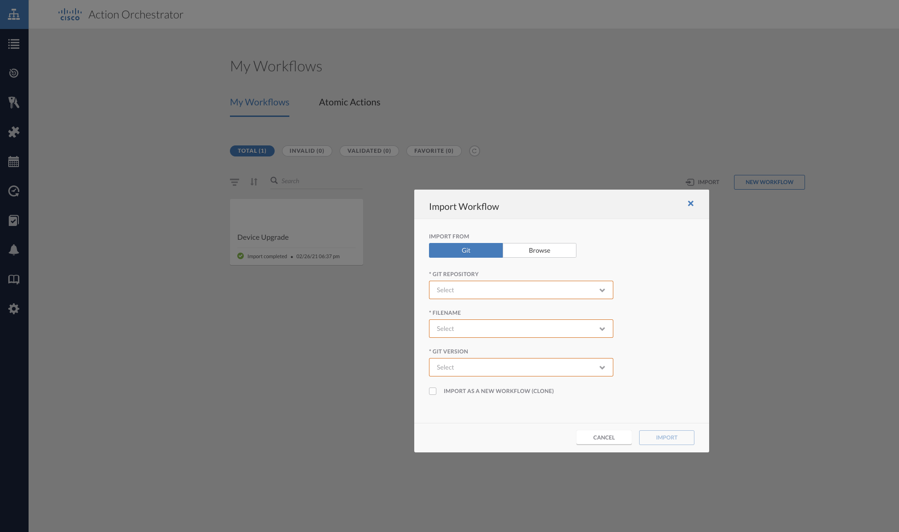

# dnac-automation
This project contains a library of workflows that provides a simple interface to the Cisco DNA Center (DNAC) Intent API.  

## Pre-Requisites
The automation library for DNAC Intent API requires as minimum the follwoing components

* Cisco Action Orchestrator(AO) 5.2.0 +
* Cisco DNA Center(DNAC) 1.3.3.9 +

## Installation

In order to install the workflow library follow the steps listed next

### 1. Add Git Repository to Cisco AO
Add the `github.com/CiscoDevNet/msx-workflow` repository  to your Cisco Action Orchestrator environment

### 2. Create Target
Create one `HTTP Endpont` target per `Cisco DNAC` you want automate

### 3. Import Workflows
Import the workflows from the Cisco

After import is successfull you must see a list like this

