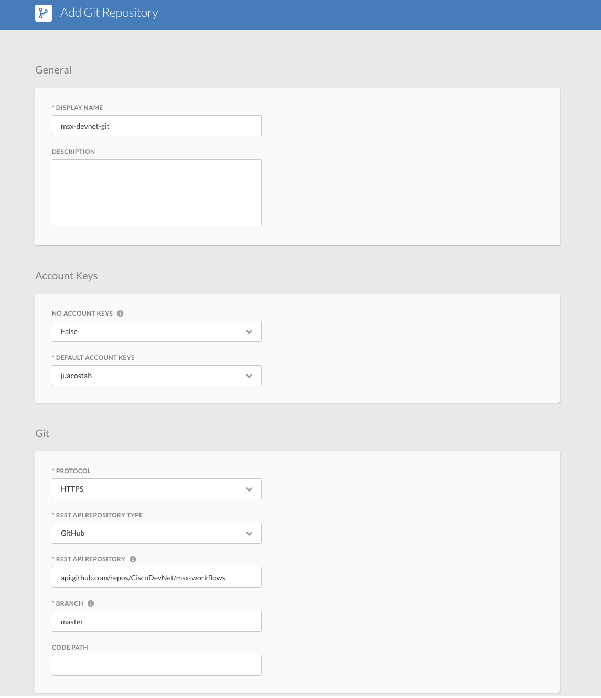
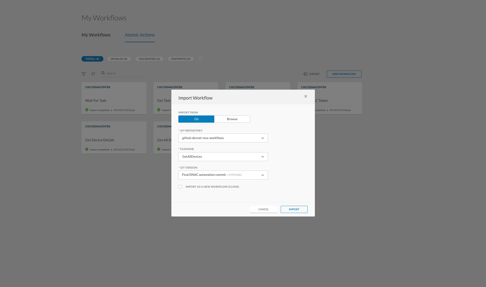
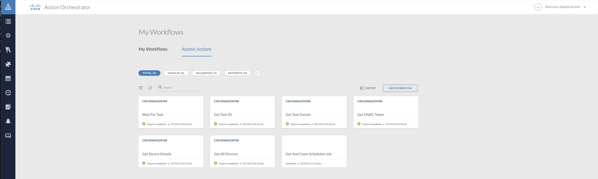

# dnac-automation
This project contains a library of workflows that provides a simple interface to the Cisco DNA Center (DNAC) Intent API.  

## Pre-Requisites
The automation library for DNAC Intent API requires as minimum the following components

* Cisco Action Orchestrator(AO) 5.2.0 +
* Cisco DNA Center(DNAC) 1.3.3.9 +

## Installation

In order to install the workflow library follow the steps listed next

### 1. Add Git Repository to Cisco AO
Add the `github.com/CiscoDevNet/msx-workflow` repository  to your Cisco Action Orchestrator environment

### 2. Create Target
Create one `HTTP Endpont` target per `Cisco DNAC` you want automate

### 3. Import Workflows
The library consists of two groups of workflows. Atomic actions, general purpose workflows containing only adaptor and core 
activities (sub-workflows are not allowed) and specialized workflows that build upon atomics. The order on which workflows get imported matter. The general guidance is:
 
1. First, import `Atomic Workflows` 
2. Second, import `Regular Workflows` 

_*Note:*_ Regular workflows can contain sub-workflows that will be imported at the same time.

Use the following AO dialog to import the workflows in the environment
 

#### 3.1 Workflows Included in the Library

##### Atomic Workflows
1. GetAllDevices
2. GetDeviceDetails
3. GetDNACToken
4. GetTaskDetails
5. GetTaskID
6. WaitForTask
##### Regular Workflows
1. CreateCLICredentials
2. CreateSNMPv2Credentials
3. DiscoverDevices

#### 3.2 Import Procedure
Follow the steps described here to successfully import the library

1. Login to Cisco AO as Adapter Author (`aoadapterauthor@cisco.com`)
2. Select the `Git Repository`
3. Select from `File Name` the workflow to be imported, e.g. `GetDNACToken`. 
4. Select the `Version` to import
5. _*DO NOT*_ `Select to Clone`
6. Select `Import` button
7. Wait for the workflow to be fully imported.
8. When the state of workflow is `Import Completed`, refresh page

After successful import of atomics, `My Workflows > Atomic Actions` will look like this

After successful import of workflows, `My Workflows > MyWorkflows` will look like this

